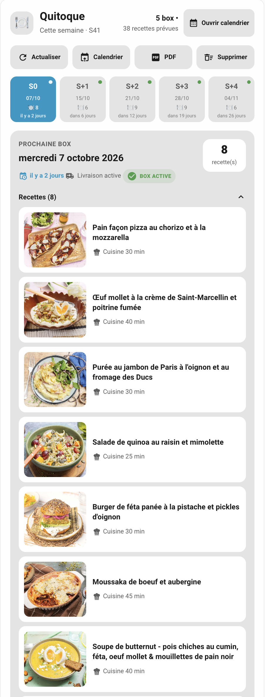
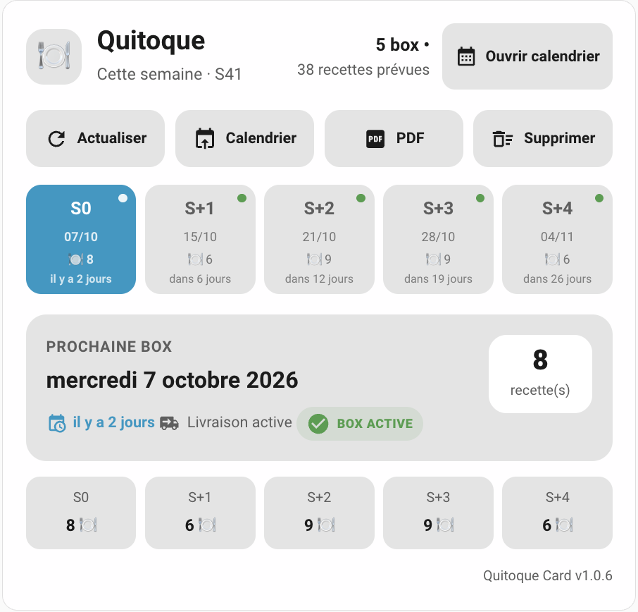
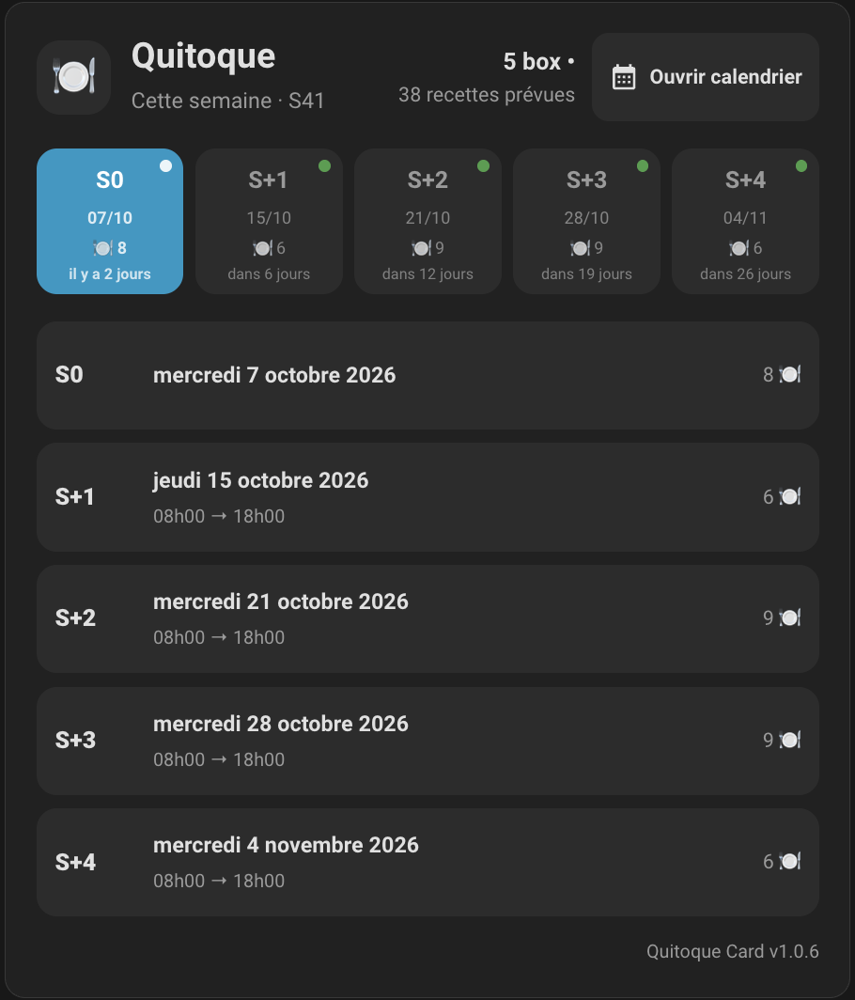

# 🥕 Quitoque Lovelace Card

[![GitHub Release][releases-shield]][releases]
[](LICENSE)
[](https://www.home-assistant.io/)
[](https://hacs.xyz/)
[](https://www.home-assistant.io/dashboards/)
[](https://github.com/AuroreVgn)
[](https://ko-fi.com/aurorevgn)

## 🏠 Mes projets Home Assistant

Retrouvez l'ensemble de mes intégrations et projets Home Assistant sur ma page dédiée :

[**🏠 Découvrir mes projets Home Assistant**](https://gentle-suggestion-7c3.notion.site/Mes-projets-Home-Assistant-3eda02eefa8f81a48621c3caeef7fa8e)

## ☕ Soutenir le projet

Si cette intégration vous est utile et que vous souhaitez soutenir son développement et sa maintenance :

<p>
  <a href="https://ko-fi.com/aurorevgn">
    
  </a>
</p>

## ⚠️ Important
Carte Lovelace personnalisée **Home Assistant** conçue pour l'intégration [Quitoque](https://github.com/AuroreVgn/quitoque).

Elle permet d'afficher les livraisons et recettes Quitoque des semaines **S0 à S+4** dans une carte dédiée, avec images, temps en cuisine, portions, créneaux de livraison et actions principales.

> [!IMPORTANT]
> Cette carte est un projet communautaire non officiel. Elle n'est ni développée, ni maintenue, ni supportée par Quitoque.

## ✨ Fonctionnalités

- Navigation entre les semaines **S0 à S+4**.
- Sélection automatique de la première semaine ayant une livraison active.
- Affichage de la date de livraison.
- Affichage du créneau horaire lorsqu'il est disponible.
- Indication relative de la livraison :
  - `aujourd'hui`
  - `demain`
  - `dans X jours`
- Affichage du nombre de recettes.
- Affichage du nombre total de box et de recettes prévues.
- Indicateur visuel **BOX ACTIVE**.
- Affichage des recettes avec :
  - image
  - nom
  - temps en cuisine
  - nombre de portions
- Repli/dépli des recettes.
- Affichage possible des semaines sans livraison.
- Vue adaptée aux écrans mobiles.
- Onglets S0 à S+4 défilables horizontalement sur petit écran.
- Trois modes d'affichage :
  - **Détaillé**
  - **Compact**
  - **Planning**
- Taille des images configurable :
  - **Petite**
  - **Moyenne**
  - **Grande**
- Actions intégrées :
  - Actualiser Quitoque
  - Ajouter les recettes au calendrier
  - Générer les PDF
  - Supprimer les PDF et archives générés.
- Bouton supplémentaire vers un **calendrier externe ou Home Assistant**, avec URL et nom personnalisables.
- Éditeur graphique utilisant les composants natifs Home Assistant.
- Sélection native de l'**instance Quitoque** utilisée pour la suppression des PDF lorsque plusieurs comptes sont configurés.
- Compatibilité avec les thèmes clair et sombre de Home Assistant.
- Interface bilingue français / anglais pour les principaux éléments de la carte.

## 📸 Screenshots

### Mode détaillé



### Mode compact



### Mode planning




## 📋 Prérequis

Cette carte nécessite l'intégration Quitoque :

[https://github.com/AuroreVgn/quitoque](https://github.com/AuroreVgn/quitoque)

La carte utilise notamment les capteurs de livraison et de recettes créés par l'intégration.

L'intégration doit fournir les attributs enrichis `recipe_details` pour profiter de l'affichage complet des recettes.

Exemple :

```yaml
recipe_details:
  - name: Bowl d'aubergine, ricotta fouettée à l'aneth
    kitchen_duration_minutes: 35
    duration_minutes: 35
    servings: 2 personnes
    image_url: https://...
```

> [!NOTE]
> La carte affiche le **temps en cuisine**. Le temps total n'est pas utilisé car Quitoque ne le fournit pas de manière suffisamment homogène.

## 🛡️ Compatibilité

La carte est conçue pour fonctionner avec l'intégration :

[Quitoque pour Home Assistant](https://github.com/AuroreVgn/quitoque)

Elle dépend des entités et attributs exposés par cette intégration.

Si une version future de l'intégration modifie les noms ou le format des attributs, une mise à jour de la carte peut être nécessaire.

## 📦 Installation

### Option A — HACS

Si ce dépôt est ajouté à HACS comme dépôt personnalisé :

1. Ouvrir **HACS**.
2. Aller dans **Frontend**.
3. Ouvrir le menu **⋮** → **Dépôts personnalisés**.
4. Ajouter l'URL du dépôt Quitoque Card.
5. Choisir la catégorie **Dashboard** / **Plugin** selon la version de HACS.
6. Installer **Quitoque Card**.
7. Recharger le navigateur.

### Option B — Installation manuelle

1. Télécharger le fichier :

```text
quitoque-card.js
```

2. Copier le fichier dans :

```text
/config/www/quitoque-card.js
```

3. Dans Home Assistant, ouvrir :

**Paramètres → Tableaux de bord → ⋮ → Ressources**

4. Ajouter :

```text
/local/quitoque-card.js
```

avec le type :

```text
Module JavaScript
```

5. Recharger complètement le navigateur :

- `Ctrl+F5` sous Windows/Linux ;
- `Cmd+Shift+R` sous macOS.

## ⚙️ Configuration minimale

Une fois la ressource chargée, ajouter une carte manuelle :

```yaml
type: custom:quitoque-card
```

La carte utilise par défaut les noms d'entités classiques de l'intégration Quitoque.

Toutes les entités peuvent également être sélectionnées depuis l'éditeur graphique.

## ⚙️ Exemple de configuration complète

```yaml
type: custom:quitoque-card

title: Quitoque
display_mode: detailed
show_empty_weeks: true
show_actions: true
recipes_collapsed: false
show_recipe_images: true
image_size: medium

delivery_week_0: sensor.quitoque_livraison_cette_semaine
delivery_week_1: sensor.quitoque_livraison_dans_1_semaine
delivery_week_2: sensor.quitoque_livraison_dans_2_semaines
delivery_week_3: sensor.quitoque_livraison_dans_3_semaines
delivery_week_4: sensor.quitoque_livraison_dans_4_semaines

recipe_count_week_0: sensor.quitoque_nombre_de_recettes_cette_semaine
recipe_count_week_1: sensor.quitoque_nombre_de_recettes_dans_1_semaine
recipe_count_week_2: sensor.quitoque_nombre_de_recettes_dans_2_semaines
recipe_count_week_3: sensor.quitoque_nombre_de_recettes_dans_3_semaines
recipe_count_week_4: sensor.quitoque_nombre_de_recettes_dans_4_semaines

refresh_button: button.quitoque_actualiser
calendar_button: button.quitoque_ajouter_les_recettes_au_calendrier
pdf_button: button.quitoque_generer_et_telecharger_les_pdf

# Facultatif si plusieurs instances Quitoque sont configurées.
config_entry_id: ""

calendar_url: /calendar
calendar_url_name: Ouvrir calendrier
```

> [!NOTE]
> Dans l'éditeur graphique, `config_entry_id` n'est pas saisi manuellement : Home Assistant propose directement les instances Quitoque disponibles dans un menu déroulant.

## 📊 Entités utilisées

### Livraisons

Par défaut :

```yaml
delivery_week_0: sensor.quitoque_livraison_cette_semaine
delivery_week_1: sensor.quitoque_livraison_dans_1_semaine
delivery_week_2: sensor.quitoque_livraison_dans_2_semaines
delivery_week_3: sensor.quitoque_livraison_dans_3_semaines
delivery_week_4: sensor.quitoque_livraison_dans_4_semaines
```

### Recettes

Par défaut :

```yaml
recipe_count_week_0: sensor.quitoque_nombre_de_recettes_cette_semaine
recipe_count_week_1: sensor.quitoque_nombre_de_recettes_dans_1_semaine
recipe_count_week_2: sensor.quitoque_nombre_de_recettes_dans_2_semaines
recipe_count_week_3: sensor.quitoque_nombre_de_recettes_dans_3_semaines
recipe_count_week_4: sensor.quitoque_nombre_de_recettes_dans_4_semaines
```

### Boutons Quitoque

Par défaut :

```yaml
refresh_button: button.quitoque_actualiser
calendar_button: button.quitoque_ajouter_les_recettes_au_calendrier
pdf_button: button.quitoque_generer_et_telecharger_les_pdf
```

Le bouton **Supprimer** n'utilise pas une entité `button.*`. Il appelle directement le service :

```text
quitoque.cleanup_pdfs
```

Si plusieurs instances de l'intégration Quitoque sont configurées, l'instance concernée peut être choisie depuis l'éditeur graphique.

## 🎛️ Modes d'affichage

### Détaillé

Le mode **Détaillé** affiche :

- la livraison sélectionnée ;
- sa date ;
- son créneau ;
- son statut ;
- le nombre de recettes ;
- les fiches de recettes avec image, durée en cuisine et portions.

Exemple :

```text
Quitoque

Actualiser | Calendrier | PDF | Supprimer

S0   S+1   S+2   S+3   S+4

Prochaine box
mercredi 26 août 2026
08h00 → 13h00
dans 4 jours
BOX ACTIVE

Recettes (4)

[IMAGE] Tarte de bricks aux nectarines...
        Cuisine 45 min
        2 personnes
```

### Compact

Le mode **Compact** fournit une vue synthétique de S0 à S+4 avec le nombre de recettes de chaque semaine.

Il est adapté aux dashboards où l'espace disponible est limité.

### Planning

Le mode **Planning** présente les semaines sous forme de liste :

```text
S0   mercredi 26 août   08h00 → 13h00   4 🍽️
S+1  mercredi 2 sept.   08h00 → 13h00   3 🍽️
S+2  Aucune livraison                    —
```

## 🎨 Éditeur graphique

La carte fournit un éditeur Home Assistant permettant de configurer directement les options sans modifier le YAML.

### Affichage

Les options disponibles comprennent notamment :

- **Titre**
- **Mode d'affichage**
  - Détaillé
  - Compact
  - Planning
- **Afficher aussi les semaines sans livraison**
- **Afficher les boutons d'action**
- **Replier les recettes par défaut**
- **Afficher les images des recettes**
- **Taille des images**
  - Petite
  - Moyenne
  - Grande

### Sélection des entités et de l'instance Quitoque

L'éditeur permet de sélectionner :

- les 5 capteurs de livraison ;
- les 5 capteurs de recettes ;
- le bouton Actualiser ;
- le bouton Ajouter au calendrier ;
- le bouton PDF ;
- l'**instance Quitoque utilisée pour la suppression des PDF**.

Les champs utilisent les sélecteurs natifs Home Assistant.

Le choix de l'instance Quitoque est facultatif lorsqu'une seule instance de l'intégration est configurée.

## 🔘 Boutons d'action

Les boutons Quitoque sont affichés directement sous le titre de la carte et au-dessus des semaines S0 à S+4.

Ils sont disposés sur une seule ligne :

```text
Actualiser | Calendrier | PDF | Supprimer
```

### Actualiser

Appuie sur :

```text
button.quitoque_actualiser
```

et force une mise à jour immédiate des données Quitoque.

Pendant l'action, la carte affiche :

```text
Actualisation…
```

### Calendrier

Appuie sur :

```text
button.quitoque_ajouter_les_recettes_au_calendrier
```

et lance la synchronisation avec le calendrier configuré dans l'intégration.

Pendant l'action :

```text
Synchronisation…
```

### PDF

Appuie sur :

```text
button.quitoque_generer_et_telecharger_les_pdf
```

et lance la génération des fiches PDF.

Pendant l'action :

```text
Génération PDF…
```

### Supprimer

Appelle directement le service :

```text
quitoque.cleanup_pdfs
```

et supprime les PDF et archives générés par l'intégration Quitoque.

Pendant l'action :

```text
Suppression…
```

Si plusieurs instances Quitoque sont configurées, l'instance cible peut être choisie dans l'éditeur graphique grâce au sélecteur natif Home Assistant.

Les autres boutons sont temporairement désactivés pendant l'exécution d'une action.

## 📅 Bouton vers un calendrier personnalisé

La carte peut également afficher un bouton indépendant permettant d'ouvrir un calendrier ou n'importe quelle URL.

Ce bouton apparaît dans l'en-tête de la carte, à droite du résumé du nombre de box et de recettes.

Deux champs sont disponibles dans l'éditeur :

```text
URL du calendrier externe
Nom du bouton calendrier
```

### Exemples d'URL

Calendrier Home Assistant :

```text
/calendar
```

ou simplement :

```text
calendar
```

Une route Home Assistant personnalisée :

```text
/lovelace/calendrier
```

Un calendrier externe :

```text
https://calendar.google.com/
```

Une URL saisie sans protocole telle que :

```text
calendar.google.com
```

est automatiquement interprétée comme :

```text
https://calendar.google.com
```

Sur mobile, le bouton calendrier externe peut être réduit à son icône afin de conserver un en-tête compact.

## 🥕 Images des recettes

La carte utilise :

```yaml
image_url
```

dans l'attribut `recipe_details`.

Si aucune image n'est disponible, une icône :

```text
mdi:chef-hat
```

est affichée à la place.

Les images utilisent le chargement différé (`loading="lazy"`).

## 🥕 Recettes repliables

En mode détaillé, la liste des recettes peut être ouverte ou fermée.

L'option :

```text
Replier les recettes par défaut
```

permet de choisir son état initial.

## 📆 Semaines sans livraison

La carte distingue plusieurs états :

- livraison active
- aucune box
- entité indisponible
- entité absente

Si l'option :

```text
Afficher aussi les semaines sans livraison
```

est désactivée, seules les semaines disposant d'une box sont conservées dans la navigation, lorsqu'il existe au moins une livraison active.

## 📱 Responsive / mobile

La carte adapte automatiquement sa présentation à la largeur disponible.

Sur petit écran :

- S0 à S+4 deviennent horizontalement défilables ;
- les 4 actions restent disposées sur une seule ligne ;
- le résumé de l'en-tête est simplifié ;
- le bouton calendrier externe utilise principalement son icône ;
- les images de grande taille sont réduites.

## 🛠️ Dépannage

### La carte n'apparaît pas

Vérifier que la ressource suivante est enregistrée :

```text
/local/quitoque-card.js
```

avec le type :

```text
Module JavaScript
```

Puis effectuer un rechargement forcé du navigateur.

### Une ancienne version reste affichée

Home Assistant et le navigateur peuvent conserver le JavaScript en cache.

Faire :

```text
Ctrl+F5
```

ou :

```text
Cmd+Shift+R
```

La version chargée est affichée en bas de la carte :

```text
Quitoque Card vX.Y.Z
```

### Une entité n'est pas trouvée

Ouvrir l'éditeur graphique de la carte et sélectionner manuellement l'entité correspondante.

### Les images ne s'affichent pas

Vérifier l'attribut :

```yaml
recipe_details:
```

du capteur de recettes concerné dans :

**Outils de développement → États**

Chaque recette doit disposer d'un champ :

```yaml
image_url:
```

## 🤝 Contributions et problèmes

Les retours, corrections et propositions d'amélioration sont les bienvenus via les issues du dépôt de la carte.

Lors d'un signalement, pensez à indiquer :

- la version de Home Assistant ;
- la version de Quitoque Card ;
- la version de l'intégration Quitoque ;
- le comportement attendu ;
- une capture d'écran si utile ;
- les erreurs de la console du navigateur lorsqu'elles sont pertinentes.

## 📄 Licence

Projet distribué sous licence [MIT](LICENSE).

[releases-shield]: https://img.shields.io/github/v/release/AuroreVgn/quitoque_card?style=flat-square
[releases]: https://github.com/AuroreVgn/quitoque_card/releases
[license-shield]: https://img.shields.io/github/license/AuroreVgn/quitoque_card?style=flat-square

## 📄 Licence

Projet distribué sous licence [MIT](LICENSE).

